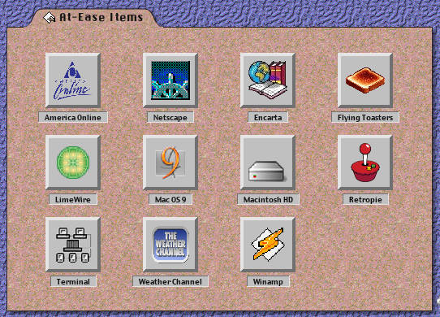

# AtEase

AtEase is a lightweight Raspberry Pi/Linux launcher shell inspired by Apple At Ease and classic Mac OS 9 pseudo-folders. It is a fan-made, classic Mac-inspired launcher for Linux and is not affiliated with Apple Inc. or Apple At Ease.

AtEase is not a full desktop environment, file manager, parental-control system, policy layer, or replacement window manager. It is a curated launcher surface that sits on the desktop, shows large beveled icon buttons, and launches Linux `.desktop` files from a controlled app directory.



## What it does

- Runs as a Tauri 2 desktop app with a TypeScript/Vite frontend and Rust backend.
- Presents a classic Mac-inspired folder-style launcher window.
- Uses a frameless, non-resizable, undecorated window.
- Can be positioned and sized for constrained displays, bezels, and custom Raspberry Pi builds.
- Defaults to a desktop-like window that skips the taskbar and stays below normal application windows.
- Scans `~/.local/share/atease/apps/` for `.desktop` launchers.
- Shows up to 12 valid apps in a 4 by 3 grid.
- Sorts app launchers by `.desktop` filename, so prefix filenames with numbers if you want a specific order.
- Resolves icons from absolute `Icon=` paths or normal Linux icon theme names.
- Caches resolved absolute icons under `~/.local/share/atease/cache/icons/` for Tauri asset access.
- Launches apps through the desktop launcher helper, first `gio launch`, then `dex` as a fallback.
- Includes a browser preview mode for layout work when Tauri is not running.
- Includes Playwright helper scripts for screenshots and layout inspection.

## Current limits

- Linux/Raspberry Pi is the target environment.
- App selection is directory-based. The current app does not use the older YAML tab/item config path for app lists.
- Only the first 12 valid `.desktop` files are shown.
- There is currently one visible folder surface, not multiple user-selectable tab pages.
- Invalid `.desktop` files are skipped rather than shown as disabled launchers.
- File or URL arguments are not passed through AtEase directly. Put complex launch behavior in the `.desktop` file or in a wrapper script.
- This is not a sandbox. Anything you place in `~/.local/share/atease/apps/` can launch whatever its `.desktop` file launches.

## Requirements

You need the normal Tauri/Linux build stack plus the desktop launch helpers used by AtEase.

On Raspberry Pi OS, Debian, or Ubuntu:

```bash
sudo apt update
sudo apt install -y \
  build-essential \
  curl \
  wget \
  file \
  libwebkit2gtk-4.1-dev \
  libssl-dev \
  libgtk-3-dev \
  libxdo-dev \
  libayatana-appindicator3-dev \
  librsvg2-dev \
  libglib2.0-bin \
  dex
```

Install Rust if you do not already have it:

```bash
curl --proto '=https' --tlsv1.2 -sSf https://sh.rustup.rs | sh
source "$HOME/.cargo/env"
```

Install Node.js and npm. Node 20 or newer is a good baseline for the current Vite/Tauri toolchain.

## Install from source

Clone the repository:

```bash
git clone https://github.com/milagrofrost/AtEase-simulator.git
cd AtEase-simulator
```

Install JavaScript dependencies:

```bash
npm install
```

Run the real Tauri app:

```bash
npm run dev:tauri
```

Run only the browser preview:

```bash
npm run dev
```

Then open:

```text
http://127.0.0.1:1420/
```

Browser preview mode shows built-in preview apps and does not launch real Linux apps. Use `npm run dev:tauri` when testing real `.desktop` launch behavior.

## Build packages

Build the configured Linux packages:

```bash
npm run build
```

Build only the Debian bundle:

```bash
npm run build:tauri
```

Debian packages are written under:

```text
src-tauri/target/release/bundle/deb/
```

RPM packages, when built, are written under:

```text
src-tauri/target/release/bundle/rpm/
```

Install a generated Debian package with:

```bash
sudo apt install ./src-tauri/target/release/bundle/deb/*.deb
```

## First run behavior

On startup, AtEase creates this directory if it does not exist:

```text
~/.local/share/atease/apps/
```

It also creates the runtime config file if it does not exist:

```text
~/.local/share/atease/config.yaml
```

AtEase does not automatically copy app launchers into the apps directory. Add your own `.desktop` files there.

## Add apps to the launcher

AtEase discovers launchers from:

```text
~/.local/share/atease/apps/
```

Each app is a normal Linux `.desktop` file. Example:

```bash
mkdir -p ~/.local/share/atease/apps
cat > ~/.local/share/atease/apps/01-terminal.desktop <<'EOF'
[Desktop Entry]
Type=Application
Name=Terminal
Comment=Open a terminal
Exec=xfce4-terminal
Icon=utilities-terminal
Terminal=false
EOF
chmod +x ~/.local/share/atease/apps/01-terminal.desktop
```

Restart AtEase after adding or changing launcher files.

### Ordering apps

AtEase sorts `.desktop` files by filename before placing them in the grid. Use numeric prefixes:

```text
01-weather.desktop
02-terminal.desktop
03-about-piforma.desktop
04-settings.desktop
```

The numeric prefix controls order. The displayed label comes from the `.desktop` file's `Name=` value.

### Launcher validation rules

A launcher is accepted only when:

- The file is inside `~/.local/share/atease/apps/`.
- The filename ends in `.desktop`.
- The file has a `[Desktop Entry]` section.
- `Type=Application` is present.
- `Name=` is present and not empty.
- `Exec=` is present and not empty.
- `Hidden=true` is not set.

`NoDisplay=true` is allowed. AtEase treats the apps directory as a curated list, so hidden-from-menu apps can still appear if you explicitly place them there.

### Icons

AtEase reads the `.desktop` file's `Icon=` value.

Good options:

```ini
Icon=utilities-terminal
```

```ini
Icon=/home/YOUR_USER/.local/share/atease/icons/weather.png
```

Icon lookup checks common icon locations, including:

```text
~/.local/share/icons/
/usr/share/pixmaps/
/usr/share/icons/
```

If an icon cannot be resolved, AtEase shows its bundled missing-icon image.

### Wrapper scripts for complex apps

For anything more complicated than a normal command, create a wrapper script and point `Exec=` at it.

Example wrapper:

```bash
mkdir -p ~/.local/bin
cat > ~/.local/bin/start-weather-kiosk <<'EOF'
#!/usr/bin/env bash
chromium-browser --kiosk "https://weatherstar.netbymatt.com/"
EOF
chmod +x ~/.local/bin/start-weather-kiosk
```

Example `.desktop` file:

```ini
[Desktop Entry]
Type=Application
Name=Weather
Comment=Open WeatherStar kiosk
Exec=/home/YOUR_USER/.local/bin/start-weather-kiosk
Icon=/home/YOUR_USER/.local/share/atease/icons/weather.png
Terminal=false
```

Use real absolute paths in `.desktop` files. Do not rely on `~` expansion inside `Exec=` or `Icon=`.

## Runtime config

Runtime config lives here:

```text
~/.local/share/atease/config.yaml
```

Default config:

```yaml
render:
  left: 71
  top: 0
  width: 673
  height: 480
  scale: 1.0
window:
  always_on_bottom: true
  skip_taskbar: true
  ignore_work_area: true
  corner_radius: 6
```

### `render`

`render.left` and `render.top` set the native window position in pixels.

`render.width` and `render.height` set the unscaled native window size.

`render.scale` multiplies the configured width and height. For example:

```yaml
render:
  left: 77
  top: 20
  width: 656
  height: 460
  scale: 1.0
```

### `window`

`always_on_bottom` controls whether AtEase asks the window manager to keep the window below normal apps.

`skip_taskbar` controls whether AtEase appears in the taskbar or pager.

`ignore_work_area` is currently present in the config for work-area behavior, but the active code does not apply a separate behavior for it yet.

`corner_radius` sets the outer launcher corner radius in pixels. Use `0` for square corners.

Restart AtEase after changing this file.

## Browser preview safe-area parameters

When running `npm run dev`, the frontend can read safe-area margins from URL query parameters. This is useful for quick layout testing in a browser.

Examples:

```text
http://127.0.0.1:1420/?left=77&top=20&right=0&bottom=0
http://127.0.0.1:1420/?safe-left=77&safe-top=20
```

Accepted names:

```text
left, safeLeft, safe-left, safe_left
right, safeRight, safe-right, safe_right
top, safeTop, safe-top, safe_top
bottom, safeBottom, safe-bottom, safe_bottom
```

These URL parameters are for the browser preview path. The packaged Tauri app uses `~/.local/share/atease/config.yaml` for native window size and position.

## Autostart on Raspberry Pi, XFCE, or Openbox

For a kiosk-like setup, launch AtEase after login using your session's normal autostart method.

For Openbox, add a line to:

```text
~/.config/openbox/autostart
```

Example:

```bash
/home/YOUR_USER/.local/bin/atease &
```

For XFCE, use Session and Startup, Application Autostart, or create a `.desktop` autostart file under:

```text
~/.config/autostart/
```

Example autostart file:

```ini
[Desktop Entry]
Type=Application
Name=AtEase
Exec=/home/YOUR_USER/.local/bin/atease
Terminal=false
X-GNOME-Autostart-enabled=true
```

Adjust the `Exec=` path to wherever the built or installed AtEase binary lives.

## Development commands

```bash
npm run dev          # Vite browser preview only
npm run dev:tauri    # Tauri desktop app with real backend commands
npm run build        # Tauri build using configured bundle targets
npm run build:tauri  # Debian bundle build
npm run build:frontend
npm run typecheck
npm run screenshot
npm run inspect
```

The screenshot and inspect scripts use Playwright and read `APP_URL` if set:

```bash
APP_URL="http://127.0.0.1:1420/?left=77" npm run screenshot
APP_URL="http://127.0.0.1:1420/" npm run inspect
```

Generated artifacts go under:

```text
artifacts/
```

## Security model

The frontend does not send arbitrary command strings to Rust. It asks for a discovered app list and then sends back only the selected app id.

The Rust backend rescans the controlled apps directory, matches the id to a `.desktop` file inside that directory, validates the entry, then delegates launch to `gio launch` or `dex`.

This prevents the web frontend from directly supplying shell commands, but it does not make `.desktop` files safe. Only place launchers in `~/.local/share/atease/apps/` that you trust.

## Troubleshooting

### No apps found

Check that the apps directory exists and contains `.desktop` files:

```bash
ls -la ~/.local/share/atease/apps/
```

Add a known-good launcher such as `01-terminal.desktop`, then restart AtEase.

### A launcher does not appear

Validate the `.desktop` file:

```bash
grep -E '^(Type|Name|Exec|Hidden|NoDisplay|Icon)=' ~/.local/share/atease/apps/01-terminal.desktop
```

Make sure:

- `Type=Application`
- `Name=` is not empty
- `Exec=` is not empty
- `Hidden=true` is not present
- The file is directly inside `~/.local/share/atease/apps/`

### A launcher appears but does not open

Try launching the same file directly:

```bash
gio launch ~/.local/share/atease/apps/01-terminal.desktop
```

If that fails, try:

```bash
dex ~/.local/share/atease/apps/01-terminal.desktop
```

If both fail, the problem is in the `.desktop` file or the target app, not the AtEase button.

### Icons are missing

Use either a known icon theme name:

```ini
Icon=utilities-terminal
```

Or an absolute image path:

```ini
Icon=/home/YOUR_USER/.local/share/atease/icons/my-icon.png
```

Then restart AtEase.

### The window is behind everything

That is the default desktop-style behavior. Edit:

```text
~/.local/share/atease/config.yaml
```

Set:

```yaml
window:
  always_on_bottom: false
  skip_taskbar: false
  ignore_work_area: true
```

Restart AtEase.

### The window is the wrong size or position

Edit the `render` section:

```yaml
render:
  left: 77
  top: 0
  width: 656
  height: 480
  scale: 1.0
```

Restart AtEase after every config change.

### Tauri build fails on Linux

Recheck the Linux dependencies listed in the Requirements section. The most common missing pieces are WebKitGTK, GTK3 development files, Rust, or Node/npm.

## Project structure

```text
src-tauri/src/
  main.rs           Tauri entrypoint, commands, and runtime window setup
  runtime_config.rs Native window position, size, and window behavior config
  desktop_apps.rs   Current app discovery, validation, icon mapping, and launch flow
  desktop_file.rs   Small .desktop parser and validation helpers
  icons.rs          Icon lookup and cache handling
  paths.rs          AtEase data paths and path helpers
  config.rs         Legacy YAML tab/item config loader, not the active app list path
  launcher.rs       Legacy launch-by-item-id path, not wired into current main.rs
  model.rs          Legacy config-backed frontend model, not wired into current main.rs

src/
  app.ts            UI rendering, browser preview, click handling, and launch animation
  tauri.ts          Frontend wrapper around Tauri commands with preview fallback
  styles.css        Retro beveled AtEase styling

scripts/
  screenshot.js     Capture a browser screenshot with Playwright
  inspect-page.js   Capture screenshot plus layout metadata

public/
  icons/            Static browser-preview and fallback assets
```

## Related example files

The repository includes older example config and app files under `examples/`. The current app-list behavior is based on `.desktop` files in `~/.local/share/atease/apps/`, not the older `examples/config.yaml` tab/item model.

Useful examples:

```text
examples/apps/terminal.desktop
examples/apps/about-piforma.desktop
```

Copy and adapt those into:

```text
~/.local/share/atease/apps/
```

## License

MIT, as declared in the Tauri package metadata.
